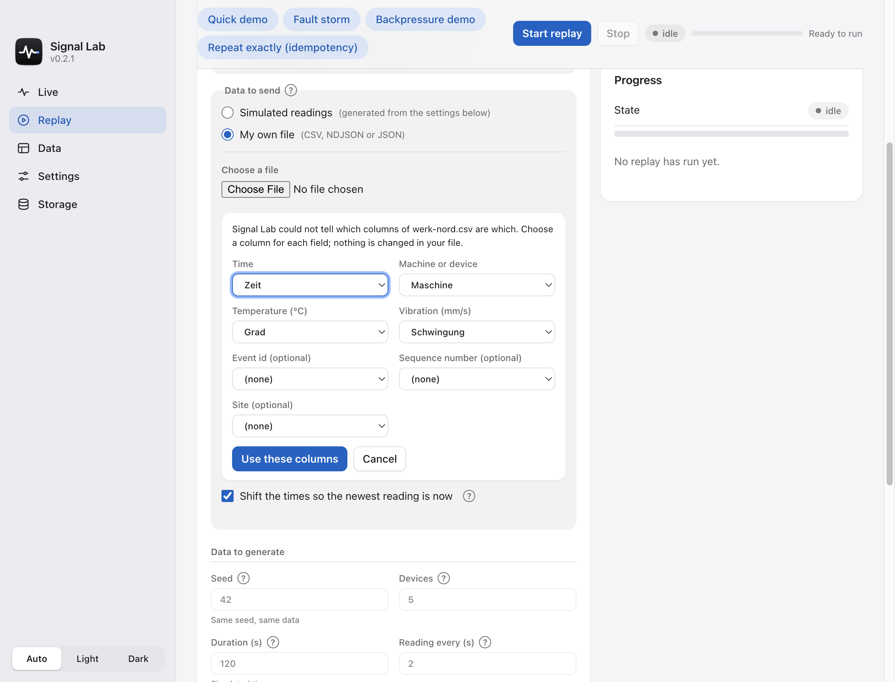
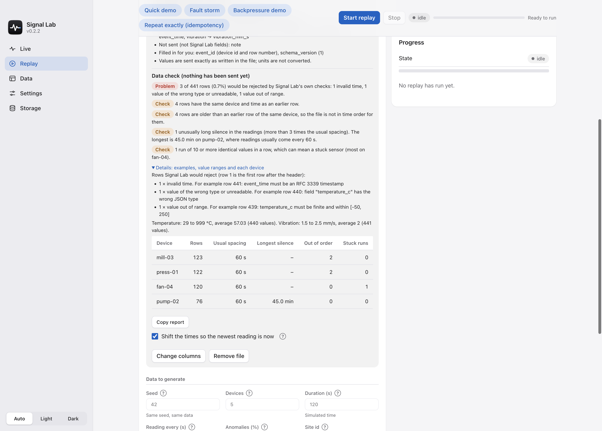
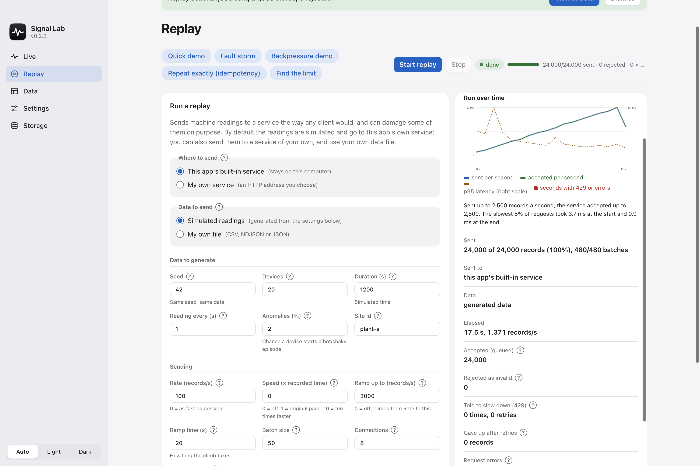

# Test your own service with Signal Lab

Signal Lab started as a simulation. With the desktop app you can also point it at **a service you
are building or running**, and replay **your own data file** through it. It then works as a small
test tool: it sends readings the way a real client would, can damage some of them on purpose, and
shows you how your service answered.

It does **not** monitor production, store your data, or replace a load-testing suite. It is for
questions like "does my ingest endpoint cope with a burst, a duplicate, a bad record, an old
timestamp?".

## Try it in two minutes

You do not need a service of your own to see how it works. The repository has a toy receiver
(standard library only, no install):

```bash
python3 examples/toy_receiver.py --capacity 60 --drain 30 --api-key secret
```

Then, in the app's **Replay** tab:

1. Under **Where to send** choose **My own service** and enter `http://127.0.0.1:3000/ingest`.
2. In **Headers** type `X-Api-Key: secret`.
3. Press **Send one test record** to check the address and header with a single reading, or press
   **Start replay** for the full run.

The results show the responses by status (`202 Accepted`, and some `429 Too Many Requests` because
the toy's pretend queue is small), and that the retries got everything through. Change the header
to a wrong key and run again: **First problem** shows the `401` and the start of the answer.
Press Ctrl-C in the terminal to see what the toy saw.

## Point it at your service

| Setting | What it does |
|---|---|
| **Service address** | `http://` or `https://` address that accepts HTTP `POST`. No user name or password in the address: use a header. |
| **Payload shape** | How readings are packed: **Batch** `{"events":[...]}` (what Signal Lab's own service expects), **Array** `[...]`, **NDJSON** (one record per line, `application/x-ndjson`), or **One record per request** (a bare JSON object). |
| **Headers** | Extra lines such as `Authorization: Bearer ...`, one `Name: value` per line, added to every request. You can override `Content-Type`. `Host`, `Content-Length`, `Connection` and similar are set by the app and cannot be changed. |
| **Batch size** | Up to 5,000 records per request for your own service (the built-in one stops at 500). Ignored for *One record per request*. |

Every record keeps the Signal Lab field names (`event_id`, `device_id`, `event_time`,
`temperature_c`, `vibration_mm_s`, ...; see the [event schema](../README.md#event-schema)). The app
also sends a `User-Agent: SignalLab/<version>` and an `X-Request-ID` per request (`sl-<run>-<n>`),
so you can find the requests in your own logs.

### What counts as what

* **Accepted**: any `2xx` answer. All records in that request count as taken, unless the answer is
  a Signal Lab acknowledgement (`{"accepted":..,"rejected":..}`) that adds up to the request, in
  which case its numbers are used. That is how it reports against another Signal Lab service.
* **Told to slow down**: `429` and `503` are retried after the `Retry-After` time (seconds or an
  HTTP date, at most 5 s; 1 s if absent), up to **Retries on 429**. Records still refused after
  that are reported as *gave up*.
* **Errors**: any other status (`400`, `401`, `404`, `500`, a redirect...) and any request that
  fails to connect or times out. These are not retried, so you see them as they are. The first one
  is kept with the start of what your service answered.
* **Redirects are not followed**: a redirect would resend your headers to another address and turn
  the `POST` into a `GET`. A `301`/`307` is reported as an error so you can fix the address.

## Use your own data

Under **Data to send** choose **My own file** and pick a CSV, NDJSON (one JSON object per line) or
JSON (an array of objects) file. It is read by the app, shown to you in summary, and kept **in
memory only** until you remove it or quit. Up to 32 MB and 200,000 rows.

The file needs a time, a device and the two measurements. Common column names are recognised:

| Signal Lab field | Also accepted (any capitalisation; spaces and dashes count as `_`) |
|---|---|
| `event_time` | `timestamp`, `time`, `ts`, `datetime`, `date_time`, `event_timestamp`, `time_utc`, `measured_at` |
| `device_id` | `device`, `device_name`, `machine`, `machine_id`, `sensor`, `sensor_id`, `asset`, `asset_id` |
| `temperature_c` | `temperature`, `temp`, `temp_c`, `temperature_celsius`, `temperature_degc` |
| `vibration_mm_s` | `vibration`, `vib`, `vibration_mms`, `vibration_mm_per_s`, `vibration_rms` |
| `event_id` | `id`, `eventid`, `reading_id`, `message_id` (optional: filled in as `<device>-<row number>`) |
| `sequence` | `seq`, `sequence_number`, `counter` (optional) |
| `site_id` | `site`, `plant`, `plant_id`, `facility` (optional) |

**Other column names?** If the app cannot tell which column is the time, the machine, the temperature or the
vibration, it shows your file's columns and asks you to choose one for each field (event id, sequence
number and site are optional). Columns you do not choose are not sent. After importing, **Change columns**
reopens that choice. Your file is never modified.



An exact Signal Lab name always wins over an alias. Other columns are **not sent** (the summary
lists them). The app's own CSV export imports as it is (`received_at` is skipped), so you can
export a run, edit it, and replay it.

### Check your data first

As soon as a file is imported the app checks all of it, **before anything is sent**, and says in plain
words what a replay would run into:



* **Rows Signal Lab would reject**, by reason, with the row numbers and what is wrong with them
  (row 1 is the first row after the header).
* **Repeated rows**: an `event_id` used twice, or the same device at the same time twice.
* **Rows out of time order** for their device.
* **Long silences**: a device that stops reporting for more than three times its usual spacing.
* **Stuck sensors**: ten or more identical values in a row.
* **Value ranges** for temperature and vibration, and a table per device (the twenty with the most
  findings, if there are more).

**Copy report** puts the same text on your clipboard (it holds counts, device names and row numbers,
not the file itself). The check takes under a second for a file at the 200,000-row limit. It reports;
it does not change or remove anything: every row is still sent, so you see how your service reacts.

What to know:

* **Values are sent exactly as written.** Units are not converted: if your temperatures are in
  Fahrenheit, they go out as Fahrenheit.
* **Dirty rows are kept on purpose.** An empty cell is sent as a missing value, and text in a number
  column is sent as text, so your service sees what your file really contains. The data check
  counts the rows that Signal Lab's own schema would reject (and why); they are sent anyway.
* **Old timestamps**: many services refuse readings from the past or the future. Leave *Shift the
  times so the newest reading is now* on to move the whole file forward by the same amount.
* **Faults still apply.** Malformed, duplicate and late rates, bursts and jitter work on your rows,
  so you can replay real data with problems added.

## Replay at the recorded pace

By default a replay sends as fast as the **Rate** allows. To send your file the way it was recorded, set
**Speed (× recorded time)** under *Sending*:

* `1` sends each reading when its time comes up in the file, so a recording of one hour takes one hour.
* `10` is ten times faster, `0.5` half as fast. `0` (the default) turns this off and uses the rate.
* **Rate is still the limit.** Readings go out no earlier than their recorded time allows and never faster than
  *Rate* per second, so a fast speed cannot overload a service. (A service outside this computer is limited to
  2,000 records per second either way.)
* Readings in one request are sent together, at the time of the first one. Set **Batch size** to `1` to follow the
  file reading by reading.
* A file that is not in time order never goes back in time: an older row is sent right after the one before it.
* A replay that would take more than **12 hours** is refused with a hint to raise the speed. The estimate under
  the settings says how long sending will take.

It works for the simulated readings too: Speed 1 plays the simulated minutes in real time.

## Find where a service gives up (ramp and chart)

Set **Ramp up to (records/s)** and **Ramp time (s)** under *Sending*. The rate then climbs in a straight line from
**Rate** to the final rate over the ramp time and holds it, so you can see at which speed your service starts
answering `429`, slowing down or failing. (*Find the limit* is a ready-made preset for the built-in service.)

While the replay runs, and afterwards, **Run over time** draws the run second by second:



* **sent per second** (blue, behind) is how hard the service was pushed; **accepted per second** (green) is what it
  took; **p95 latency** (amber, dashed, right scale) is how long the slowest 5% of requests took.
* A **red bar** marks every second that had `429` answers or errors.
* Under the chart the app says in words when the first `429` or error came and how many records a second were
  being sent then. **Copy results** includes this text.

For a service outside this computer the final rate may not exceed 2,000 records per second, like the rate itself.
The chart keeps the first hour of a run. A measured example, with the machine and the method, is in
[BENCHMARKS.md](BENCHMARKS.md).

## What to try

| Question | Setting | What to look for |
|---|---|---|
| Does bad input get a clear `4xx`, not a `500` or a crash? | **Malformed (%)** | *Responses* and *First problem*; your service's own logs |
| Is it safe to resend? | **Duplicated (%)**, or **Repeat exactly** with the same file | Your database should hold each event once |
| Does it accept old data? | **Late (%)**, **Late by** | `4xx` for old timestamps, or accepted and stored at the original time |
| Does it push back under load? | **Rate**, **Connections**, **Burst every N batches** | `429`/`503` answers with a sensible `Retry-After`, and a latency that stays bounded |
| Does the client recover? | **Retries on 429** | *Gave up after retries* should be zero once the load drops |

## Reading the results


*Sent to* and *Data* say where the readings went and where they came from. *Responses* counts the
answers per HTTP status. *Request latency* is how long each request took (p50 is typical; p95 and
p99 are the slow ones). *First problem* is the first failed request with up to 300 characters of
what your service answered, cleaned to one line. Response codes are shown as chips
(green for `2xx`, amber for `429` and redirects, red for other errors) and the latency as four small bars.
**Copy results** puts a plain-text summary on the clipboard; it names only the host, never the path, key
or header values. Readings sent to your own service are **not
stored in the app**, so they do not appear in the Live or Data tabs: look in your service.

## Safety and limits

* **Only you can start it.** The control panel needs the per-launch token, and a web page cannot
  start a replay on its own.
* **Your address, headers and key stay private.** Header values are kept in memory for the run and
  never saved, shown again or logged. Only the scheme and host (`https://api.example.com`) appear
  in the panel and the log: an API key in the path or query string is never shown.
* **The app's own access token is never sent to your service.**
* **Not on this computer?** Then you must tick *I own this service or have permission to send test
  traffic to it*, and the rate must be between 1 and 2,000 records per second. This keeps a typo
  from turning the app into a flood tool. A service on `localhost` or `127.0.0.1` needs neither.
* **TLS** certificates are checked; there is no option to skip that. For a local service with a
  self-signed certificate use plain `http://` on `localhost`.
* **Proxies**: standard proxy environment variables (`HTTPS_PROXY`, `NO_PROXY`) are honoured.

## Limitations

* Readings always use the Signal Lab field names and units. You can choose which of your columns
  feeds each field, but there is no template for another schema, no unit conversion, and columns you
  do not choose are dropped.
* It sends `POST` requests with a static set of headers. There are no login flows, token refresh,
  request signing or other methods.
* It does not check what your service answers beyond the status (and the Signal Lab acknowledgement
  shape when there is one), and it does not read your data back to verify it.
* One replay at a time. The imported file is lost when the app quits.
